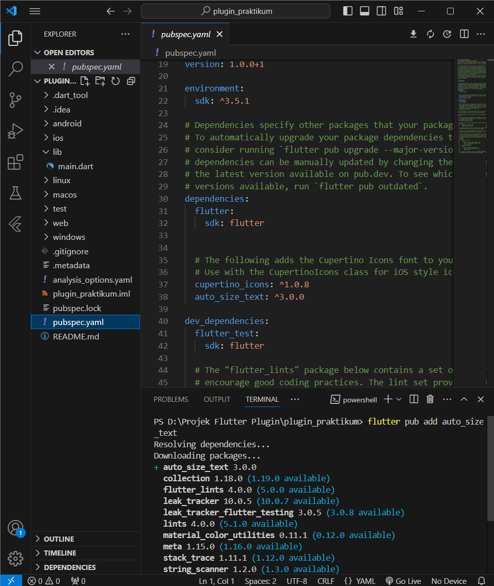
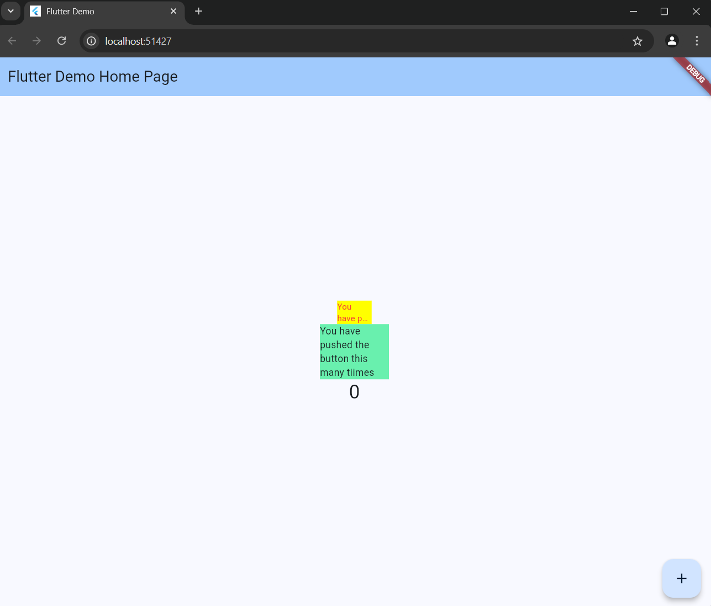

# plugin_praktikum

A new Flutter project.

## Getting Started

This project is a starting point for a Flutter application.

A few resources to get you started if this is your first Flutter project:

- [Lab: Write your first Flutter app](https://docs.flutter.dev/get-started/codelab)
- [Cookbook: Useful Flutter samples](https://docs.flutter.dev/cookbook)

For help getting started with Flutter development, view the
[online documentation](https://docs.flutter.dev/), which offers tutorials,
samples, guidance on mobile development, and a full API reference.

# Praktikum Plugin
1. Dokumentasi
Setelah memasang/menambahkan plugin auto_size_text 
Hasil akhir dari praktikum dan sesuai dengan arahan yang ada dimodul 
2. Langkah kedua dalam praktikum tersebut adalah menambahkan pluggin auto_size_text keadalam projek dengan menggunakan perintah di terminal.
3. Langkah kelima tersebut memiliki tujuan untuk mendeklarasikan variabel text didalam class RedTextWidget.
4. Container pertama berfungsi untuk pembungkus yang memiliki latar belakang berwarna yellowAccent dan memiliki lebar sebesar 50.
Container kedua berfungsi sebagai pembungkus yang memiliki latar belakang greenAccent dengan lebat 100.
Perbedaanya adalah penyesuaian ukuran text yang pertama memiliki ukuran text yang dibatasi hanya 50 saja kalau yang kedua memiliki ukuran text yang dibatasi lebih besar yaitu 100.
5. a. Parameter 'key' untuk mengontrol bagaimana widget mengganti widget lain di tree,
b. Parameter 'textKey' mengatur kunci untuk Text widget yang dihasilkan,
c. Parameter 'style' untuk menambahkan gaya pada text ,
d. Parameter 'minFontSize' untuk batasan ukuran teks minimum yang akan digunakan saat mengubah ukuran teks secara otomatis,
e. Parameter 'maxFontSize' untuk batas ukuran maksimum yang akan digunakan saat mengubah ukuran teks secara otomatis,
f. Parameter 'stepGranularity' Ukuran langkah di mana ukuran font disesuaikan dengan batasan,
g. Parameter 'presetFontSizes' untuk menentukan ukuran font yang memungkinkan,
h. Parameter 'group' Untuk sinkronisasikan ukuran beberapa AutoSizeTexts,
i. Parameter 'textAlign' Untuk mensejajarkan text secara horizontal,
j. Parameter 'textDirection' Menentukan bagaimana textAlignnilai seperti TextAlign.startdan TextAlign.enddiinterpretasikan,
k. Parameter 'locale' Digunakan untuk memilih font ketika karakter Unicode yang sama dapat ditampilkan secara berbeda, tergantung pada lokal,
l. Parameter 'softWrap'	Untuk meputus text pada jeda baris lunak,
m. Parameter 'wrapWords' Untuk memuat dalam satu baris yang dibungkus,
n. Parameter 'overflow' Menangani visual,
o. Parameter 'overflowReplacement'	Jika teksnya meluap dan tidak sesuai batasnya, widget ini akan ditampilkan sebagai gantinya,
p. Parameter 'textScaleFactor' Jumlah piksel font untuk setiap piksel logis,
q. Parameter 'maxLines'	Jumlah baris maksimum opsional untuk teks yang akan direntangkan, dan
r. Parameter 'semanticsLabel' Label semantik alternatif untuk teks.